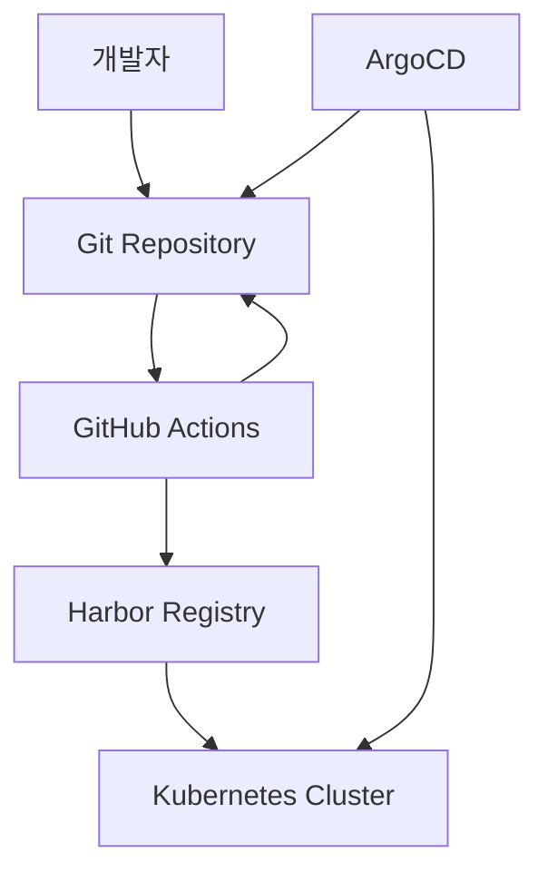
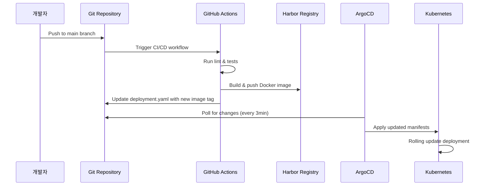

# ImageHub Dashboard - GitOps with ArgoCD

이 문서는 ArgoCD를 사용한 ImageHub Dashboard의 GitOps 구현에 대해 설명합니다.

## 개요

GitOps는 Git을 단일 진실 소스(Single Source of Truth)로 사용하여 애플리케이션과 인프라를 관리하는 방법론입니다. ArgoCD를 통해 자동화된 배포와 지속적인 동기화를 구현합니다.

## 아키텍처



## 구성 요소

### 1. ArgoCD Application (`application.yaml`)
- **이름**: imagehub-dashboard
- **네임스페이스**: argocd
- **소스**: Git Repository의 `k8s/update` 디렉토리
- **대상**: kps-hub 네임스페이스
- **동기화**: 자동 (prune + selfHeal 활성화)

### 2. ArgoCD Project (`project.yaml`)
- **이름**: imagehub-dashboard-project
- **리포지토리 제한**: GitHub 리포지토리만 허용
- **대상 제한**: kps-hub 네임스페이스만 허용
- **리소스 제한**: 필요한 Kubernetes 리소스만 허용
- **RBAC**: developer, admin 역할 정의

### 3. GitHub Actions Workflow (`.github/workflows/ci-cd.yaml`)
- **Lint & Test**: 코드 품질 검사
- **Build & Push**: Docker 이미지 빌드 및 Harbor 푸시
- **Update Manifests**: Kubernetes 매니페스트의 이미지 태그 업데이트
- **Setup ArgoCD**: ArgoCD Application 생성/업데이트

## 설정 방법

### 1. ArgoCD Application 배포

```bash
# ArgoCD Application 생성
kubectl apply -f argocd/

# 상태 확인
kubectl get applications -n argocd
kubectl get appprojects -n argocd
```

### 2. GitHub Secrets 설정

GitHub 리포지토리 Settings > Secrets and variables > Actions에서 다음 시크릿을 설정:

```bash
# Harbor Registry 인증
HARBOR_USERNAME=admin
HARBOR_PASSWORD=your_password

# Kubernetes 클러스터 접근 (base64 인코딩)
KUBECONFIG=base64_encoded_kubeconfig
```

### 3. ArgoCD 웹 UI 접근

```bash
# ArgoCD 서버 접근 (LoadBalancer 사용)
kubectl get svc argocd-server -n argocd

# 또는 포트 포워딩
kubectl port-forward svc/argocd-server -n argocd 8080:443

# 초기 admin 비밀번호 확인
kubectl -n argocd get secret argocd-initial-admin-secret -o jsonpath="{.data.password}" | base64 -d
```

## GitOps 워크플로우

### 1. 코드 변경 플로우



### 2. 배포 전략

- **Rolling Update**: 무중단 배포
- **Health Checks**: Startup, Readiness, Liveness 프로브
- **Auto Scaling**: HPA로 자동 스케일링
- **Self Healing**: ArgoCD가 드리프트 자동 복구

### 3. 동기화 정책

```yaml
syncPolicy:
  automated:
    prune: true        # 삭제된 리소스 자동 정리
    selfHeal: true     # 드리프트 자동 복구
    allowEmpty: false  # 빈 매니페스트 허용 안함
  syncOptions:
    - CreateNamespace=false
    - PrunePropagationPolicy=foreground
    - PruneLast=true
```

## 모니터링 및 운영

### ArgoCD 상태 확인

```bash
# Application 상태
kubectl get applications -n argocd

# 상세 정보
kubectl describe application imagehub-dashboard -n argocd

# ArgoCD CLI 사용 (설치 필요)
argocd app list
argocd app get imagehub-dashboard
argocd app sync imagehub-dashboard
```

### 로그 확인

```bash
# ArgoCD Application Controller 로그
kubectl logs -n argocd deployment/argocd-application-controller

# ArgoCD Server 로그
kubectl logs -n argocd deployment/argocd-server

# ImageHub Dashboard 애플리케이션 로그
kubectl logs -n kps-hub deployment/imagehub-dashboard
```

### 문제 해결

#### 1. 동기화 실패
```bash
# Application 상태 확인
argocd app get imagehub-dashboard

# 수동 동기화 시도
argocd app sync imagehub-dashboard --prune

# 강제 새로고침
argocd app refresh imagehub-dashboard
```

#### 2. 이미지 풀 오류
```bash
# Harbor Registry 접근 확인
kubectl get pods -n kps-hub
kubectl describe pod <pod-name> -n kps-hub

# Registry 시크릿 확인
kubectl get secrets -n kps-hub
```

#### 3. 헬스체크 실패
```bash
# Pod 로그 확인
kubectl logs -n kps-hub deployment/imagehub-dashboard

# 서비스 엔드포인트 확인
kubectl get endpoints -n kps-hub
```

## 보안 고려사항

### 1. RBAC 설정
- ArgoCD Project에서 리소스 접근 제한
- 최소 권한 원칙 적용
- 역할 기반 접근 제어

### 2. Git Repository 보안
- Private Repository 사용 권장
- Branch Protection Rules 설정
- Code Review 필수화

### 3. 시크릿 관리
- Kubernetes Secrets 사용
- 환경별 시크릿 분리
- 시크릿 로테이션 정책

## 확장 계획

### 1. 멀티 환경 지원
- Development, Staging, Production 환경 분리
- 환경별 ArgoCD Project 생성
- Kustomize Overlay 사용

### 2. 고급 배포 전략
- Blue-Green Deployment
- Canary Deployment
- Feature Flags 통합

### 3. 모니터링 통합
- Prometheus + Grafana 연동
- AlertManager 알림 설정
- 애플리케이션 메트릭 수집

## 참고 자료

- [ArgoCD 공식 문서](https://argo-cd.readthedocs.io/)
- [GitOps 모범 사례](https://opengitops.dev/)
- [Kubernetes 배포 전략](https://kubernetes.io/docs/concepts/workloads/controllers/deployment/)
- [Harbor Registry 사용법](https://goharbor.io/docs/)